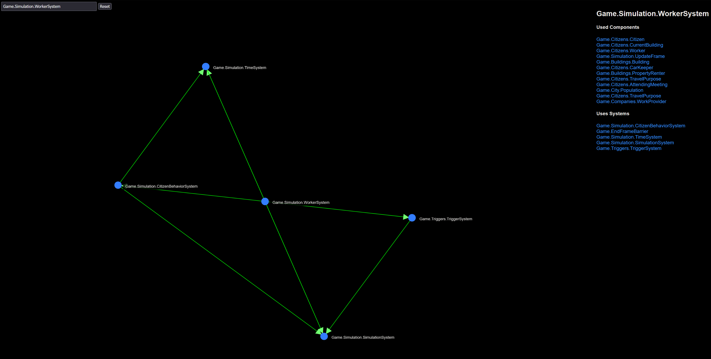

# cs2-ecs-explorer

This project is a interactive explorer of ECS relevant parts of the Cities: Skylines 2 codebase.

Currently, it supports extracting the following details from decompiled source-code:

- Systems
    - What Systems each System reference
    - What Systems reference this System
    - What Components this System uses
- Components
    - What properties this Component has
    - What Systems uses this Component

Raw, extracted data can be found in the `data/` directory.

Interactive graph is located in `index.html` and `index.js`, which reads the `Components.json` and `Systems.json` files from the `data/` directory.

## License

2023 MIT - Captain-Of-Coit